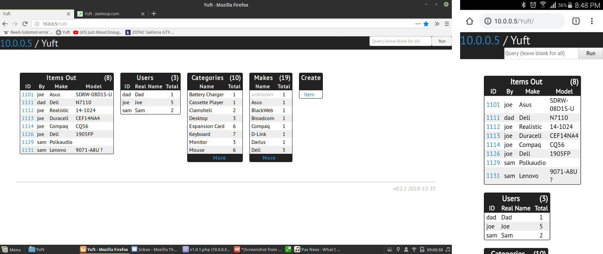

# Yuft

Yuft is an inventory thing (actually it's more of a thing to keep track of who has what) so I know who to ask if I can't find stuff. It's about functionality (which it's not good at, yet), not eye candy.

Left to right: Yuft v0.1.1 on desktop; mobile:

Right now it's terrible, <del>but I'm working on a **huge** update!</del> and this project has been abandoned.
